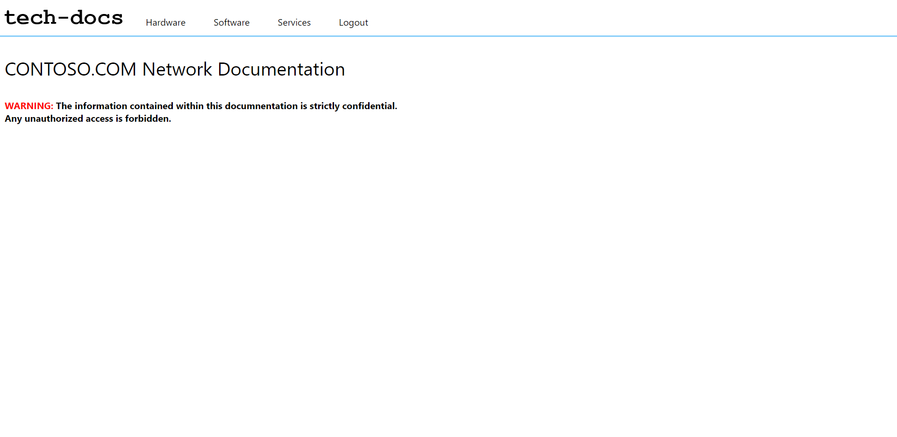

  # tech-docs

  

  ## Description
  Tech-docs is an online resource for creating and managing Network Documentation. It allows you to track the network Hardware, software, and services that run your IT infrastructure and keep all of your important documentation in one place.

  ## Live Link
  [Heroku](https://evening-gorge-96741.herokuapp.com/)

  

  ## Table of Contents
  * [Description](#description)
  * [Installation](#installation)
  * [Usage](#usage)
  * [License](#license)
  * [Contribution](#contribute)
  * [Questions](#questions)

  ## Installation
  The application is available online, at the Live link listed above.

  ## Usage
  The live link above is for demo purposes. You can sign up or log in if you already have an account. Once logged in, you can access the documentation categories and add, update, or delete the sample data there.

  ## License
  This software is licensed under the [MIT license](https://choosealicense.com/licenses/mit/).

  ## Contribution
  This project follows the guidelines of the [Contributor Covenant](https://www.contributor-covenant.org/version/2/0/code_of_conduct/). If you are interested in contributing, please contact me at my email in the Questions section of this README.

  ## Questions
  If you have any questions about this project, you can email me at joe.lawton@outlook.com.
  For other projects, check out my [GitHub](https://github.com/jdlawton).
